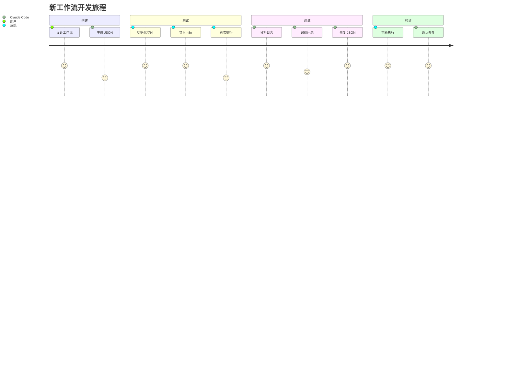
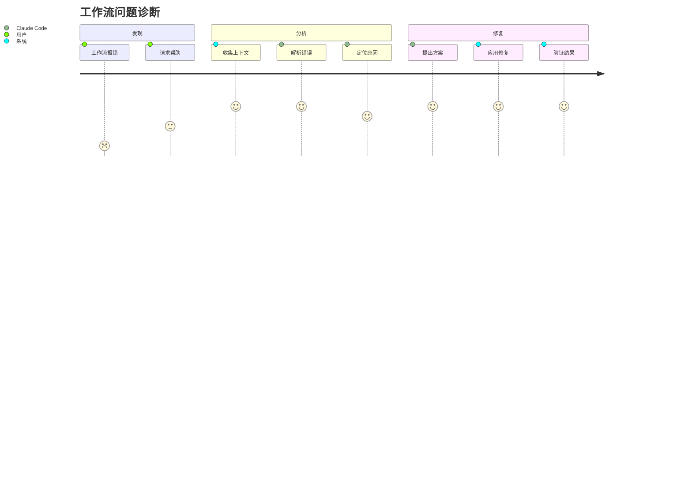
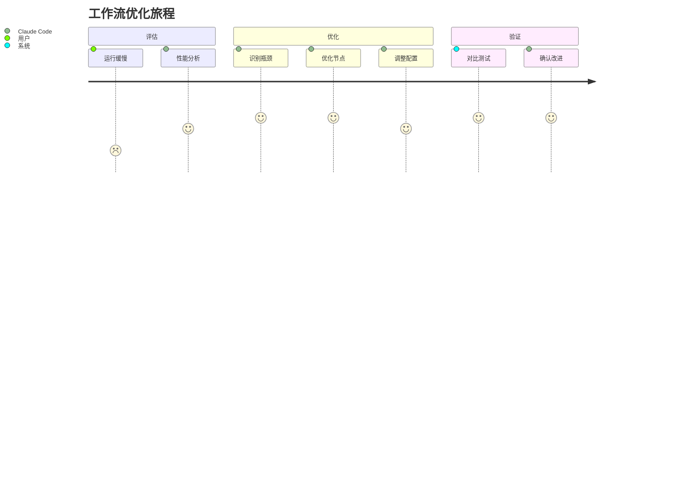

# n8n-integration: Claude Code 智能工作流调试系统

## 🎯 核心理念

### 愿景
构建一个智能化的 n8n 工作流调试生态系统，让 Claude Code 能够像经验丰富的工程师一样，自主分析、诊断和修复工作流问题。

### 设计哲学
- **完整上下文收集**：每次执行都保存完整的调试信息，让 AI 拥有充分的分析依据
- **自动化路径管理**：智能管理工作流空间，无需人工干预目录结构
- **迭代式优化**：支持循环调试，每次迭代都基于前次的经验改进
- **透明可追溯**：所有操作都有日志记录，版本管理确保可回滚

## 🚀 系统架构

```
┌─────────────────┐     ┌──────────────┐     ┌─────────────┐
│  Claude Code    │────▶│  Integration │────▶│    n8n      │
│   (分析/修复)    │◀────│    System    │◀────│   (执行)     │
└─────────────────┘     └──────────────┘     └─────────────┘
        │                      │                     │
        ▼                      ▼                     ▼
   workflow.json        logs/context           API/CLI执行
```

## 👤 用户旅程

### 场景一：新工作流开发


### 场景二：问题诊断


### 场景三：性能优化


## 🛠 核心功能

### 1. 智能工作空间管理
- **自动命名**：从 JSON 文件名智能提取工作流名称
- **空间隔离**：每个工作流拥有独立的目录结构
- **版本控制**：自动备份历史版本，支持回滚
- **智能复用**：同名工作流自动使用已有空间

### 2. 全生命周期管理
```
创建 → 导入 → 执行 → 调试 → 优化 → 归档
```

每个阶段都有对应的工具支持：
- **创建**：Claude Code 生成工作流 JSON
- **导入**：API/CLI 导入到 n8n
- **执行**：支持 API 和 CLI 两种执行方式
- **调试**：完整的日志和上下文收集
- **优化**：基于执行数据的性能分析
- **归档**：版本管理和清理机制

### 3. 深度调试能力

#### 日志层次
```
├── 执行日志 (execution_*.log)
│   ├── 时间戳和元数据
│   ├── 节点执行顺序
│   ├── 输入输出数据
│   └── 性能指标
├── 错误日志 (errors_*.log)
│   ├── 错误类型
│   ├── 堆栈跟踪
│   └── 相关节点
└── 上下文 (context_*.json)
    ├── 环境变量
    ├── 系统信息
    └── 工作流配置
```

#### 分析维度
- **结构分析**：节点关系、数据流向
- **性能分析**：执行时间、资源消耗
- **错误分析**：失败原因、错误传播
- **兼容性分析**：版本依赖、API 兼容

### 4. Claude Code 集成

#### 信息获取
Claude Code 可以获取：
- 完整的执行日志
- 结构化的错误信息
- 环境和配置上下文
- 历史执行记录

#### 操作能力
Claude Code 可以：
- 修改工作流 JSON
- 触发重新执行
- 分析执行结果
- 提出优化建议

## 📊 数据流设计

```
输入层：
  JSON 文件 ──┐
              ├──▶ WorkflowManager ──▶ 工作空间
  配置文件 ──┘

处理层：
  工作空间 ──▶ Import ──▶ n8n API ──▶ workflow_id
           ──▶ Execute ──▶ 执行结果 ──▶ 日志文件
           ──▶ Context ──▶ 调试信息 ──▶ 分析报告

输出层：
  日志文件 ──┐
  错误报告 ──├──▶ Claude Code ──▶ 修复方案
  上下文  ──┘
```

## 🔄 工作流状态机

```
        ┌──────────┐
        │  Created  │
        └─────┬─────┘
              │ setup
        ┌─────▼─────┐
        │Initialized│
        └─────┬─────┘
              │ import
        ┌─────▼─────┐
     ┌──│ Imported  │◀─┐
     │  └─────┬─────┘  │
     │        │ run    │ fix
     │  ┌─────▼─────┐  │
     └──│Executing  │──┘
        └─────┬─────┘
              │
        ┌─────▼─────┐
        │ Completed │
        └───────────┘
```

## 🎨 设计模式

### 1. 工厂模式
- `WorkflowManager` 作为工厂类创建和管理工作空间

### 2. 策略模式
- 执行策略：API 优先，CLI 备选
- 日志策略：按时间戳组织，自动清理

### 3. 观察者模式
- 日志系统观察执行过程
- 上下文收集器监控系统状态

## 📈 扩展性设计

### 插件架构
```python
# 自定义分析器
class CustomAnalyzer:
    def analyze(self, workspace):
        # 自定义分析逻辑
        pass

# 自定义执行器
class CustomExecutor:
    def execute(self, workflow_id):
        # 自定义执行逻辑
        pass
```

### 钩子系统
- `pre_import`: 导入前预处理
- `post_execute`: 执行后处理
- `on_error`: 错误处理
- `on_success`: 成功回调

## 🔐 安全考虑

### 敏感信息保护
- API Key 脱敏处理
- 凭据信息不记录
- 环境变量选择性收集

### 访问控制
- 工作空间隔离
- 文件权限管理
- API 认证支持

## 📋 快速开始

### 前置要求
- Python 3.7+
- n8n 实例运行中 (本地或远程)
- n8n REST API 已启用

### 安装依赖
```bash
pip install requests psutil
```

### 配置系统
```bash
# 编辑配置文件
vi n8n-integration/config.json

# 设置 n8n API 地址和密钥
{
  "n8n_api": {
    "base_url": "http://localhost:5678",
    "api_key": "your-api-key"
  }
}
```

### 运行示例
```bash
# 使用示例工作流测试
python n8n-integration/scripts/workflow_manager.py debug \
  --json n8n-integration/example_workflow.json \
  --auto-fix
```

## 📖 详细使用方法

### 1. 基础命令

#### 设置工作空间
为新的工作流 JSON 创建或更新工作空间：
```bash
python n8n-integration/scripts/workflow_manager.py setup --json /path/to/workflow.json
```

#### 列出所有工作空间
查看当前管理的所有工作流：
```bash
python n8n-integration/scripts/workflow_manager.py list
```
输出示例：
```
📁 Available Workspaces:
------------------------------------------------------------
  • example_workflow
    Last modified: 2024-09-28T14:30:00
    Versions: 3
  • data_pipeline
    Last modified: 2024-09-28T15:45:00
    Versions: 7
```

#### 运行工作流
执行指定的工作流：
```bash
# 基础运行
python n8n-integration/scripts/workflow_manager.py run --name example_workflow

# 带调试信息
python n8n-integration/scripts/workflow_manager.py run --name example_workflow --debug
```

#### 调试循环
完整的调试循环（导入→执行→收集上下文）：
```bash
# 手动修复模式
python n8n-integration/scripts/workflow_manager.py debug --json workflow.json

# 自动修复模式（等待 Claude Code 分析）
python n8n-integration/scripts/workflow_manager.py debug --json workflow.json --auto-fix

# 设置最大迭代次数
python n8n-integration/scripts/workflow_manager.py debug --json workflow.json --auto-fix --max-iterations 5
```

#### 清理旧日志
保持工作空间整洁：
```bash
# 保留最近 5 个日志
python n8n-integration/scripts/workflow_manager.py cleanup --name example_workflow --keep 5

# 清理所有工作空间
for dir in n8n-integration/workflows/*/; do
  name=$(basename "$dir")
  python n8n-integration/scripts/workflow_manager.py cleanup --name "$name"
done
```

### 2. 高级用法

#### 单独执行各步骤

##### 导入工作流
```bash
python n8n-integration/scripts/import_workflow.py \
  --workspace n8n-integration/workflows/example_workflow/

# 仅验证不导入
python n8n-integration/scripts/import_workflow.py \
  --workspace n8n-integration/workflows/example_workflow/ \
  --validate-only
```

##### 执行工作流
```bash
python n8n-integration/scripts/execute_workflow.py \
  --workspace n8n-integration/workflows/example_workflow/ \
  --workflow-id abc123 \
  --debug

# 使用 CLI 方式执行
python n8n-integration/scripts/execute_workflow.py \
  --workspace n8n-integration/workflows/example_workflow/ \
  --workflow-id abc123 \
  --method cli
```

##### 收集上下文
```bash
python n8n-integration/scripts/collect_context.py \
  --workspace n8n-integration/workflows/example_workflow/

# 最小化上下文收集
python n8n-integration/scripts/collect_context.py \
  --workspace n8n-integration/workflows/example_workflow/ \
  --minimal
```

### 3. Claude Code 使用场景

#### 场景 1: 创建新工作流
```python
# Claude Code 生成工作流 JSON
workflow_json = {
    "name": "My New Workflow",
    "nodes": [...],
    "connections": {...}
}

# 保存到文件
with open("my_workflow.json", "w") as f:
    json.dump(workflow_json, f, indent=2)

# 初始化并运行
os.system("python n8n-integration/scripts/workflow_manager.py debug --json my_workflow.json")
```

#### 场景 2: 调试失败的工作流
```python
# Claude Code 分析日志
with open("n8n-integration/workflows/my_workflow/logs/execution_latest.log") as f:
    log_content = f.read()

# 识别错误模式
if "Authentication failed" in log_content:
    # 修复凭据配置
    fix_credentials()
elif "Timeout" in log_content:
    # 增加超时时间
    increase_timeout()

# 重新执行验证
os.system("python n8n-integration/scripts/workflow_manager.py run --name my_workflow --debug")
```

#### 场景 3: 批量优化工作流
```python
# Claude Code 批量分析
import glob

for workflow_file in glob.glob("workflows/*.json"):
    # 分析每个工作流
    result = analyze_workflow(workflow_file)

    if result.needs_optimization:
        # 应用优化
        optimized_json = optimize_workflow(workflow_file)

        # 测试优化效果
        os.system(f"python scripts/workflow_manager.py debug --json {optimized_json}")
```

### 4. 环境变量配置

可以通过环境变量配置系统：
```bash
# 设置 n8n API 地址
export N8N_API_URL=http://localhost:5678

# 设置 API 密钥
export N8N_API_KEY=your-api-key

# 设置日志级别
export N8N_LOG_LEVEL=debug

# 运行时会自动读取这些环境变量
python n8n-integration/scripts/workflow_manager.py run --name example_workflow
```

### 5. 配置文件详解

`config.json` 完整配置选项：
```json
{
  "n8n_api": {
    "base_url": "http://localhost:5678",  // n8n 地址
    "api_key": ""                          // API 密钥（可选）
  },
  "paths": {
    "workflows": "./workflows",            // 工作流目录
    "logs": "./logs",                      // 全局日志目录
    "context": "./context"                 // 全局上下文目录
  },
  "debug": {
    "log_level": "debug",                  // 日志级别: debug/info/warning/error
    "capture_env": true,                   // 是否收集环境变量
    "save_execution_data": true,           // 是否保存执行数据
    "keep_last_logs": 10                   // 保留最近 N 个日志
  },
  "execution": {
    "default_method": "api",               // 默认执行方式: api/cli
    "timeout_seconds": 60,                 // 执行超时时间
    "poll_interval": 1,                    // 状态轮询间隔
    "retry_on_failure": true,              // 失败后重试
    "max_retries": 3                       // 最大重试次数
  },
  "workspace": {
    "auto_backup": true,                   // 自动备份
    "version_control": true,               // 版本控制
    "cleanup_old_versions": true,          // 清理旧版本
    "max_versions_per_workflow": 20        // 每个工作流最多保留版本数
  }
}
```

### 6. 故障排查

#### n8n 连接问题
```bash
# 检查 n8n 是否运行
curl http://localhost:5678/healthz

# 测试 API 连接
curl -H "X-N8N-API-KEY: your-key" http://localhost:5678/api/v1/workflows
```

#### 权限问题
```bash
# 确保脚本有执行权限
chmod +x n8n-integration/scripts/*.py

# 确保目录有写权限
chmod -R 755 n8n-integration/workflows/
```

#### 调试信息
```bash
# 查看最新错误
tail -n 50 n8n-integration/workflows/*/logs/errors_*.log

# 查看执行摘要
cat n8n-integration/workflows/*/context/summary_*.txt

# 实时监控日志
tail -f n8n-integration/workflows/*/logs/execution_*.log
```

### 7. 集成到 CI/CD

#### GitHub Actions 示例
```yaml
name: Workflow Validation

on:
  push:
    paths:
      - 'workflows/*.json'

jobs:
  validate:
    runs-on: ubuntu-latest

    steps:
    - uses: actions/checkout@v2

    - name: Setup Python
      uses: actions/setup-python@v2
      with:
        python-version: '3.9'

    - name: Install dependencies
      run: pip install requests psutil

    - name: Validate Workflows
      run: |
        for workflow in workflows/*.json; do
          python n8n-integration/scripts/workflow_manager.py setup --json "$workflow"
          python n8n-integration/scripts/import_workflow.py --validate-only \
            --workspace "n8n-integration/workflows/$(basename $workflow .json)/"
        done
```

#### Docker 集成
```dockerfile
FROM python:3.9-slim

WORKDIR /app

COPY n8n-integration/ ./n8n-integration/
RUN pip install requests psutil

ENTRYPOINT ["python", "n8n-integration/scripts/workflow_manager.py"]
```

使用 Docker：
```bash
# 构建镜像
docker build -t n8n-debugger .

# 运行调试
docker run -v $(pwd)/workflows:/app/workflows n8n-debugger debug --json /app/workflows/example.json
```

### 8. API 使用

系统也可以作为库使用：
```python
from n8n_integration.scripts.workflow_manager import WorkflowManager

# 创建管理器实例
manager = WorkflowManager()

# 设置工作空间
workspace = manager.setup_workspace("my_workflow.json")

# 运行工作流
success = manager.run_workflow("my_workflow", debug=True)

# 清理日志
manager.cleanup_old_logs("my_workflow", keep_last=5)
```

## 🚦 路线图

### Phase 1: 基础功能 ✅
- [x] 工作空间管理
- [x] 导入/执行/调试
- [x] 日志收集
- [x] Claude Code 集成

### Phase 2: 增强功能 🔄
- [ ] 批量工作流管理
- [ ] 性能基准测试
- [ ] 可视化调试界面
- [ ] 工作流模板库

### Phase 3: 高级功能 📅
- [ ] 分布式执行
- [ ] 实时监控
- [ ] 自动修复建议
- [ ] ML 驱动的问题预测

## 🤝 贡献指南

欢迎贡献代码、报告问题或提出建议！

### 开发环境
```bash
# 克隆项目
git clone [project-url]

# 安装开发依赖
pip install -r requirements-dev.txt

# 运行测试
pytest tests/
```

### 代码规范
- Python 3.7+ 兼容
- PEP 8 代码风格
- 类型提示 (Type Hints)
- 文档字符串 (Docstrings)

## 📄 许可证

MIT License - 详见 LICENSE 文件

## 🙏 致谢

- n8n 团队提供的优秀工作流平台
- Claude/Anthropic 团队的 AI 能力支持
- 开源社区的贡献和反馈

---

## 📞 联系方式

- 问题反馈：[创建 Issue]
- 功能建议：[Discussion]
- 安全问题：[私信联系]

---

**让工作流调试变得智能、高效、愉悦！** 🎉